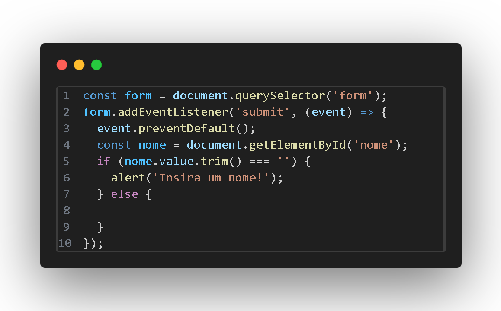
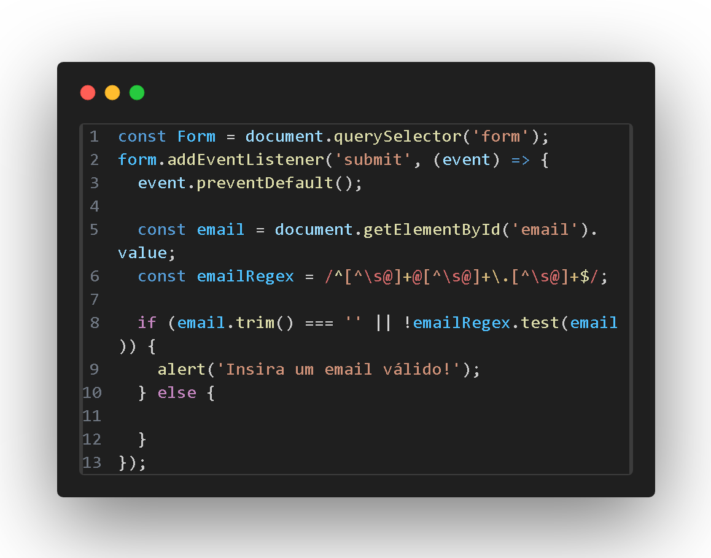
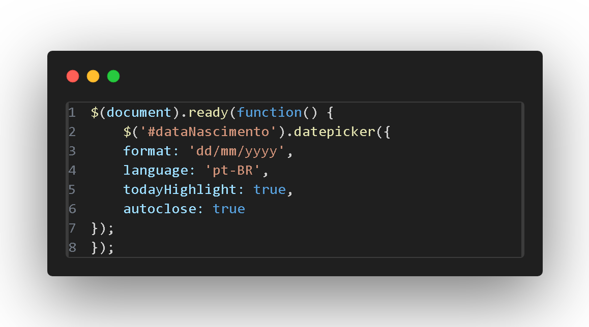
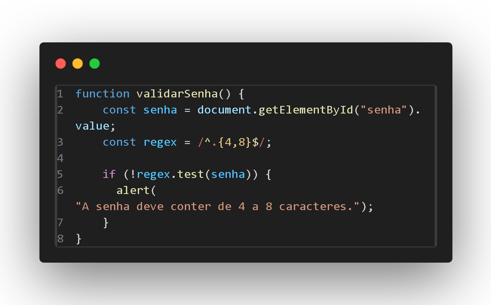

    

# Complete Data Form

# Introduction

### A form design that combines field validation and API consumption provides a robust and interactive solution for collecting and processing user data. This combination allows you to create more intuitive and personalized experiences while ensuring data integrity.

### This current project is developed on the basis of three other already documented projects, where these projects aim to validate fields in a more robust way in relation to other validations that use only one language. Therefore, the validations are as follows:
 - [x] Email Validation
 - [x] CPF validation
 - [x] ZIP code validation

# Development

### In this chapter we will present the functions in JavaScript that relate to the user experience in such a way that changes it to a more dynamic and functional way.

# Name Validation 

### The JavaScript code presented aims to validate a simple form before submitting it. More specifically, it checks whether the "name" field is populated. If it is empty, an alert is displayed to the user, and form submission is prevented.

# Email Validation

### This JavaScript code aims to validate an email field in an HTML form. It verifies that the value entered in the field matches a valid email format. Defines a regular expression (regex) to validate the format of an email address. This regex checks that the value contains an "@" and a period (."") in the correct places.

# Dynamic Calendar

### The JavaScript code presented configures a date selection component (DatePicker) in an HTML element with the ID "dataNascimento", using the jQuery library. This component allows the user to select a date more intuitively, instead of typing it manually.

# Password Validation

### The validatePassword() function aims to check whether the password entered by a user in a web form meets a specific criterion: having between 4 and 8 characters. How it works:

 - Search for password: The function locates the HTML element where the password was entered.
 - Checks length: Uses a regular expression to compare the number of characters in the password with the allowed range (4 to 8).
 - Displays message: If the password is not within the range, the function displays an alert message informing the user of the error.

# Conclusions

# Used Tecnologies

## [CPF Validation](https://github.com/VictorEvangelista2/Validacao_de_CPF)
## [CEP Validation](https://github.com/VictorEvangelista2/form-CadEndereco)
## [Password Validation](https://github.com/VictorEvangelista2/Validacao_de_Cadastro)
## [Email Validation](https://github.com/VictorEvangelista2/Validacao_de_Cadastro)
## [Bootstrap 5](https://getbootstrap.com/docs/5.0/getting-started/introduction/)
## [Stack Overflow](https://stackoverflow.com/questions/67527490/integrating-bootstrap-theme-into-current-shopify-theme?rq=1)
## [Canva](https://www.canva.com/)
## [Pigment Shape](https://pigment.shapefactory.co/?a=301E54&b=F4494F)
## [Da Font](https://www.dafont.com/pt/theme.php?cat=501&page=6)
## [Wix](https://manage.wix.com/account/websites?referralAdditionalInfo=Route)
## [Forms On Fire](https://www.formsonfire.com/)